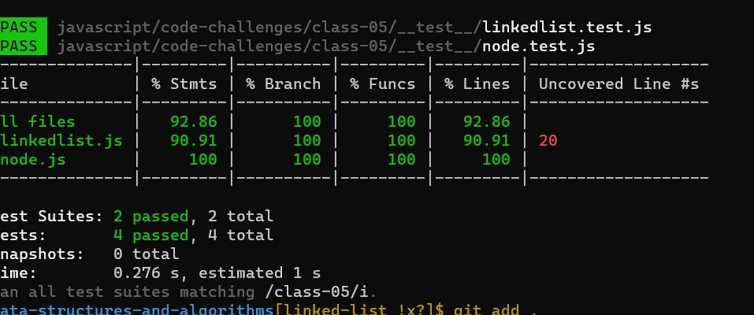

# Singly Linked List
<!-- Short summary or background information -->
***Singly linked list is a basic linked list type. Singly linked list is a collection of nodes linked together in a sequential way where each node of singly linked list contains a data field and an address field which contains the reference of the next node.***
## Challenge
<!-- Description of the challenge -->
## Linked List
***Create a Linked List class***

***Within your Linked List class, include a head property.***

***Upon instantiation, an empty Linked List should be created.***

***The class should contain the following methods***

***insert***

***Arguments: value***

***Returns: nothing***

***Adds a new node with that value to the head of the list with an O(1) Time***

***performance.***

***includes***

***Arguments: value***

***Returns: Boolean***

***Indicates whether that value exists as a Node’s value somewhere within the list.***

***to string***

***Arguments: none***

***Returns: a string representing all the values in the Linked List, formatted as:***

***tests***

***"{ a } -> { b } -> { c } -> NULL"***

## Approach & Efficiency
<!-- What approach did you take? Why? What is the Big O space/time for this approach? -->

## API
<!-- Description of each method publicly available to your Linked List -->